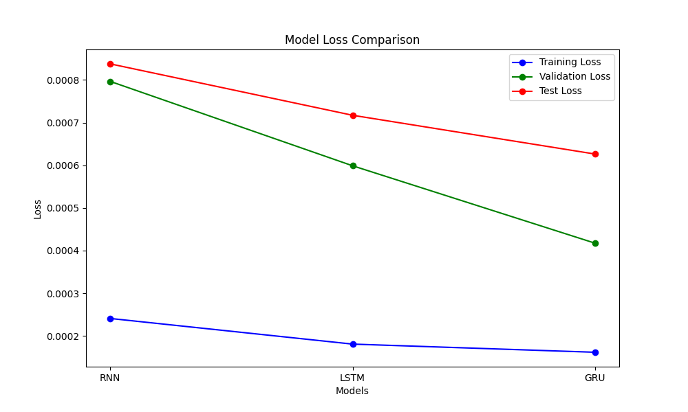
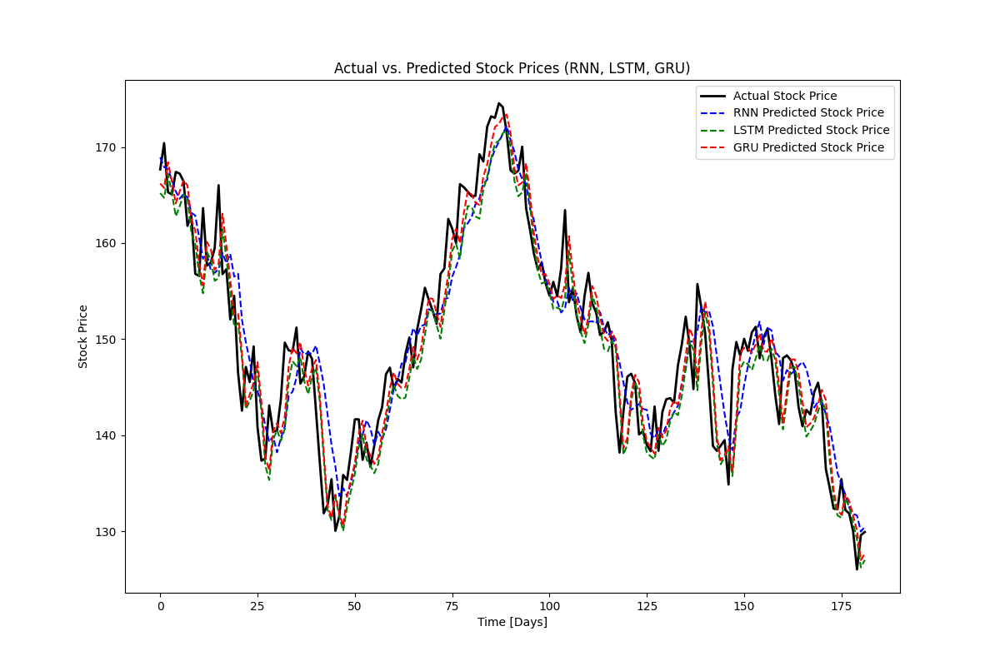

# **Stock Price Prediction (for Apple Inc.)**

## **Problem Definition**

The goal of this project is to develop a predictive model that forecasts future stock prices based on historical data. Stock prices fluctuate based on market conditions, financial performance, and investor sentiment, making them challenging to predict. By leveraging sequential models such as Recurrent Neural Networks (RNN), Long Short-Term Memory (LSTM), and Gated Recurrent Unit (GRU), the aim is to capture temporal dependencies in the stock price data and predict future trends.

This project will evaluate the performance of each model and determine which provides the most accurate forecasts for future stock prices.

**Goals:**

1. **Data Collection:** Gather historical stock market data for Apple Inc. from a reliable source (Yahoo Finance).

2. **Data Preprocessing:** Clean and scale the data, split it into training, validation, and test sets, and prepare it for time-series modeling.

3. **Model Training:** Build, train, and evaluate RNN, LSTM, and GRU models.
Model Comparison: Compare the performance of each model using metrics such as Mean Absolute Error (MAE) and R-squared (R²).

4. **Prediction Module:** Develop a prediction module that will serve as the foundation for deploying the best-performing model for real-time stock price prediction.

5. **Visualization:** Visualize both the actual and predicted stock prices to assess model performance.

## **Project Structure**

```plain text
Stock_Price_Prediction/
├── data/                  
│   ├── raw/                # Unprocessed historical stock data
│   ├── processed/          # Preprocessed and scaled data used for model training
├── models/                 # Directory for saving trained models
├── notebooks/              
│   ├── 01_data_collection.ipynb     # Collect stock price data from Yahoo Finance
│   ├── 02_data_preprocessing.ipynb  # Clean, preprocess, and split the data
│   ├── 03_eda_visualization.ipynb   # Exploratory data analysis and visualization of stock prices
│   ├── 04_modeling_rnn.ipynb        # Build, train, and evaluate the RNN model
│   ├── 05_modeling_lstm.ipynb       # Build, train, and evaluate the LSTM model
│   ├── 06_modeling_gru.ipynb        # Build, train, and evaluate the GRU model
│   ├── 07_model_comparison.ipynb    # Compare RNN, LSTM, and GRU model performances
│   ├── 08_model_deployment.ipynb    # Develop a function for predicting stock price for the next n days.
├── src/                             
│   ├── predict.py                   # Script to make stock price predictions using the trained model
├── plots/                           # Store visualizations such as loss curves and stock price predictions
├── README.md                        # Project documentation
├── requirements.txt                 # List of dependencies
```

## **Data Source**

The stock price data used in this project was collected from Yahoo Finance for Apple Inc. (AAPL). The data includes features such as Open, High, Low, Close, Adj Close, and Volume, covering daily stock prices from 2018 to 2022.

## **Key Steps in the Project**

1. **Data Collection**
Historical stock data for Apple was collected using the `yfinance` library, which provides easy access to financial data. The data was downloaded and saved in the `data/raw/` directory.

2. **Exploratory Data Analysis (EDA)**
An exploratory data analysis was conducted to understand the data distribution and trends. Visualizations such as stock price movement over time and correlations between different features were generated to uncover insights and assist in feature selection.

3. **Data Preprocessing**
In this phase, the stock price data was prepared for time series modeling by selecting the Close price as the key feature for prediction. The data was normalized using `MinMaxScaler` to a 0-1 range for consistent model processing. Sequences of 50 days' closing prices were created as input features, with the next day's closing price as the target. The data was split into training (70%), validation (15%), and test (15%) sets, preserving the temporal order to prevent data leakage. All preprocessed data, along with the fitted `MinMaxScaler`, was saved for consistency in future predictions and scaling reversals.

4. **Model Training and Evaluation**
Three models—RNN, LSTM, and GRU—were trained to predict stock prices. Each model was evaluated using the following metrics:

- **Loss (MSE):** Measures the mean squared error of predictions.
- **Mean Absolute Error (MAE):** Quantifies the average absolute difference between predicted and actual stock prices.
- **R-squared (R²):** Indicates how well the model explains the variance in the stock prices.

## **Model Performance Comparison**
| Model | Training Loss | Validation Loss | Test Loss | MAE  | R²    |
|-------|---------------|-----------------|-----------|------|-------|
| RNN   | 0.0002409     | 0.0007966       | 0.0008377 | 3.34 | 0.847 |
| LSTM  | 0.0001808     | 0.0005988       | 0.0007172 | 3.15 | 0.869 |
| GRU   | 0.0001616     | 0.0004174       | 0.0006263 | 2.94 | 0.886 |

- **Model Loss Comparison**


- **Actual vs. Predicted Stock Prices (RNN, LSTM, GRU)**


## **Model Deployment**
A `predict.py` script was created in the `src/` directory to allow for stock price predictions. This script takes the trained model and historical data, predicting stock prices for a user-specified number of future days. Predictions are scaled back to the original price scale using the saved `MinMaxScaler`.
```python
import numpy as np
import joblib
from keras.models import load_model

# Load the trained model and scaler, and the last window
model_path = '../models/gru_model.keras'
scaler_path = '../data/processed/scaler.pkl'
last_window_path = '../data/processed/last_window.npy'

model = load_model(model_path)
scaler = joblib.load(scaler_path)
last_window = np.load(last_window_path)

def predict_next_n_days(model, scaler, last_window, n_days):
    predictions = []
    current_input = last_window
    
    for _ in range(n_days):
        prediction_scaled = model.predict(current_input)
        prediction = scaler.inverse_transform(prediction_scaled)
        predictions.append(prediction[0][0])
        
        # Reshape prediction_scaled to have the same shape as current_input[:, -1:, :]
        prediction_scaled = np.reshape(prediction_scaled, (1, 1, 1))
        
        # Append the predicted value to the current input and shift
        new_input = np.append(current_input[:, 1:, :], prediction_scaled, axis=1)
        current_input = new_input
    
    return predictions

if __name__ == "__main__":
    # Predict stock prices for the next N days
    n_days = int(input("Enter the number of days for prediction: "))
    
    # Load the last window of data from a saved file
    last_window = last_window

    predictions = predict_next_n_days(model, scaler, last_window, n_days)

    print(f"Predicted stock prices for the next {n_days} days:")
    for i, pred in enumerate(predictions, 1):
        print(f"Day {i}: {pred}")
```

To run predictions from the terminal, navigate to the `src/` directory and run the following:

```bash
python predict.py
```

## **Conclusion**

This project demonstrated the capability of deep learning models such as RNN, LSTM, and GRU to predict stock prices. Among the models, the GRU model showed the best performance, with the lowest MAE and highest R². However, all models captured the stock price trends well, indicating the effectiveness of sequential models for time-series prediction.

## **Requirements**
To run this project, install the necessary dependencies using:
```bash
pip install -r requirements.txt
```